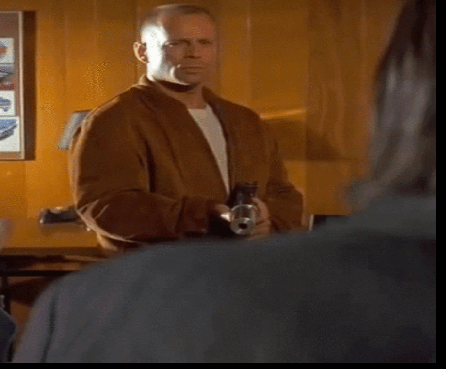

# Object Oriented Programming Game Project - Code Fiction

# Welcome to Code Fiction

-This game follows the same general principles of the Nyan Cats in which, enemies fall from the sky and your character must avoid them at all cost. However, this game is tailored to be played more as a platformer... Wherein the character, Vince Vega, must traverse across the play field in order to attain the ever elusive briefcase. The game commences when the player presses the "Start Game" button.

# The Game

This is the general layout of the game, the Cats have been replaced by Butch in the game and the hitbox was adjusted so that when Butch is touch the Vega character, the game ends. 

# Losing

-This is the losing video that gets played if the player dies by butch. No spoilers and if you have not watched Pulp Fiction yet, and intend to do so, I suggest you don't die. (**spoilers**)

# Winning

If you traverse across the gaming platform and reach briefcase, you have won the game and will be brought back to the main menu. 

Ideally, I would have liked to have added more levels and gravity to the game but that will be added when I have more time:).

